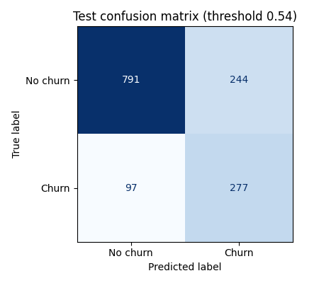
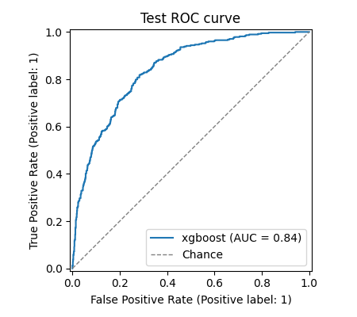
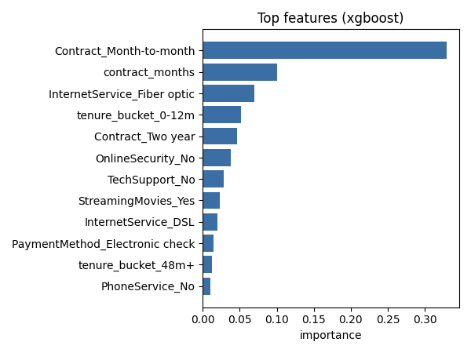

# Customer Churn Prediction

An end-to-end churn prediction project on the IBM Telco Customer Churn dataset (7,043
customers). It covers exploratory analysis, feature engineering on the main churn drivers,
a comparison of Logistic Regression, Random Forest and XGBoost with stratified
cross-validation, decision threshold tuning, and a small Streamlit app where a business
user can enter a customer profile and get a churn probability in real time.

## Results

Real results on the full IBM Telco dataset (7,043 customers, 26.5% churners), from
`python -m churn.train` and `python -m churn.evaluate`. The test set is a stratified 20%
hold-out (1,409 customers) that is not used for model selection or threshold tuning. All
values are copied from [`reports/metrics.json`](reports/metrics.json).

Model comparison, 5-fold stratified cross-validation on the training set (80%):

| Model | CV F1 (churn class), mean +/- std | CV ROC AUC |
|---|---|---|
| Logistic Regression | 0.627 +/- 0.020 | 0.846 |
| Random Forest | 0.631 +/- 0.023 | 0.844 |
| XGBoost | **0.633 +/- 0.017** | 0.844 |

The three models are within one standard deviation of each other. XGBoost has the best mean
CV F1 and is the one kept. Its decision threshold, tuned on out-of-fold predictions, is 0.54.

Final scores of XGBoost on the held-out test set:

| Metric | Value | What it means |
|---|---|---|
| F1, churn class | **0.62** | Harmonic mean of precision and recall for the churn class (the main metric). |
| Precision, churn class | 0.53 | Of the customers flagged as churners, 53% actually churned. |
| Recall, churn class | **0.74** | The model catches 74% of the customers who churned (277 of 374). |
| ROC AUC | **0.84** | Probability that a random churner gets a higher score than a random non-churner; threshold independent. |
| Weighted F1 | 0.77 | F1 of each class averaged by class size (dominated by the majority "no churn" class). |
| Accuracy | 0.76 | Share of all test customers classified correctly. |
| Majority-class baseline accuracy | 0.73 | Accuracy of always predicting "no churn". |
| Accuracy gain over the baseline | +2.3 points (+3.2% relative) | 75.8% vs 73.5%. |

How to read these numbers:

- Accuracy is not the goal here. The threshold is tuned for F1 on the churn class, which
  trades some accuracy for recall: the model flags 521 customers, finds 277 of the 374
  churners and misses 97, at the cost of 244 false alarms.
- The majority baseline never finds a single churner (recall 0), so its 73.5% accuracy is
  not useful in practice even though it is close to the model's.
- F1 around 0.6 and ROC AUC around 0.84 are in the usual range for this public dataset with
  standard models and no leakage.

<p>
  
  
  
</p>

The most important features are the month-to-month contract, contract length, fiber optic
internet and a tenure under 12 months, which matches the churn drivers seen in the EDA
notebook. Exact numbers can move slightly with library versions; rerunning the two commands
regenerates `reports/metrics.json` and the three figures.

## Project structure

```
customer-churn-prediction/
├── app/
│   └── streamlit_app.py     # web form -> churn probability + top drivers
├── data/
│   └── README.md            # how to download the dataset (CSV not committed)
├── models/                  # saved model (churn_model.joblib), not committed
├── notebooks/
│   └── 01_eda.ipynb         # exploratory data analysis
├── reports/                 # metrics.json + test-set figures (committed)
├── src/churn/
│   ├── config.py            # paths, column lists, training settings
│   ├── data.py              # loading, cleaning, stratified split
│   ├── features.py          # feature engineering + preprocessing pipeline
│   ├── train.py             # model comparison, threshold tuning, saving
│   ├── evaluate.py          # metrics and test-set evaluation
│   └── predict.py           # loading the model and scoring customers
├── tests/                   # pytest on a small synthetic dataset
├── Makefile
├── pyproject.toml
└── requirements.txt
```

## Dataset

IBM Telco Customer Churn, available on Kaggle
([blastchar/telco-customer-churn](https://www.kaggle.com/datasets/blastchar/telco-customer-churn)).
Each row is a customer with demographics, subscribed services, account details and a
`Churn` label (left within the last month). Download instructions and a column overview
are in [data/README.md](data/README.md).

## How to run

Requires Python 3.10+.

```bash
# 1. Install
python -m venv .venv && source .venv/bin/activate
pip install -r requirements.txt
pip install -e .

# 2. Put WA_Fn-UseC_-Telco-Customer-Churn.csv in data/ (see data/README.md for the
#    Kaggle download or a direct mirror from IBM's GitHub)

# 3. Train: compares the three models, saves models/churn_model.joblib
#    and reports/metrics.json
python -m churn.train

# 4. Evaluate the saved model on the test set (confusion matrix, classification report)
#    and save the figures in reports/
python -m churn.evaluate

# 5. Launch the app
streamlit run app/streamlit_app.py

# Tests
pytest
```

The same commands are available as `make install`, `make train`, `make evaluate`,
`make app` and `make test`.

## Approach

**Exploratory analysis** (`notebooks/01_eda.ipynb`). The notebook checks the class balance
(26.5% churners), the data quality issue in `TotalCharges` (11 blanks, all at tenure 0),
and the churn rate by contract type, payment method, internet service, tech support and
tenure. Churn is concentrated in month-to-month contracts (42.7% vs 2.8% on two-year
contracts), in the first year of tenure (48.3% vs 9.6% after four years), among
electronic check payers (45.3%) and among fiber optic customers (41.9%).

**Cleaning** (`src/churn/data.py`). `TotalCharges` is converted from text to a number; its
blank values belong to customers with tenure 0 and are set to 0. `SeniorCitizen` is
recoded from 0/1 to No/Yes like the other flags, `customerID` is dropped and the target
is encoded as 1 for churn.

**Features** (`src/churn/features.py`):

- `tenure_bucket`: 0-12, 12-24, 24-48 and 48+ months, since churn risk drops sharply after the first year;
- `charges_per_tenure_month`: `TotalCharges / max(tenure, 1)`, the average monthly bill over the customer's lifetime;
- `num_services`: number of phone and internet add-ons the customer subscribes to;
- `contract_months`: contract length as a number (1, 12, 24), so its order is kept;
- `auto_payment`: whether the customer pays by automatic bank transfer or credit card.

Numeric columns are standardised and categorical columns are one-hot encoded with a
`ColumnTransformer`. The feature engineering step is part of the scikit-learn `Pipeline`,
so the saved model takes raw customer rows directly (this is what the app sends it).

**Models** (`src/churn/train.py`). Logistic Regression, Random Forest and XGBoost are
trained on a stratified 80/20 split and compared with 5-fold stratified cross-validation
on the training set. Class imbalance is handled with `class_weight="balanced"` for the
first two and `scale_pos_weight` for XGBoost. The model with the best mean CV F1 is kept.

**Evaluation**. F1 on the churn class is the main metric, because missing a churner and
contacting a loyal customer both have a cost, and accuracy is inflated by the majority
class. The decision threshold is tuned to maximise F1 on out-of-fold predictions from the
training set, so the test set is only used once for the final scores. The model,
threshold and model name are saved together with `joblib`.

**App** (`app/streamlit_app.py`). A form with the customer's account, demographic and
service details. It returns the churn probability, says whether it is above the tuned
threshold, and shows the model's global feature importances as the top churn drivers.

## Next steps

- Hyperparameter search (e.g. `RandomizedSearchCV`) for XGBoost and Random Forest.
- Per-customer explanations with SHAP instead of global feature importance.
- Choose the threshold from a retention cost/benefit estimate rather than F1 alone.
- Probability calibration, so the displayed percentage can be read as a real risk.
- Track experiments (MLflow) and add a CI workflow that runs the tests.

## License

MIT, see [LICENSE](LICENSE).
